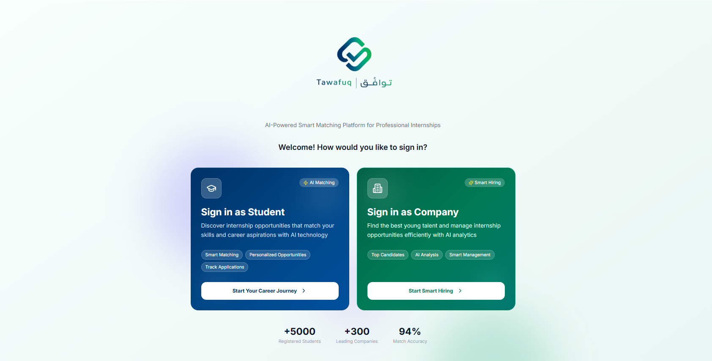
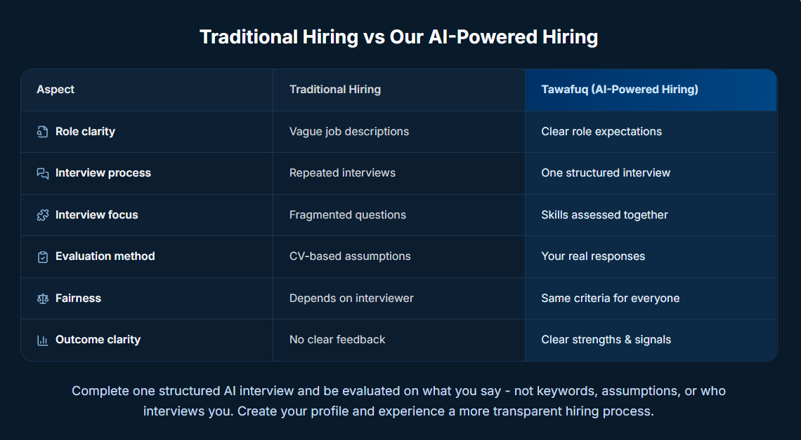

> Built during Buildathon 2026 • Award-winning project

# Twafuq

Internships should be earned through potential, not chance.

Twafuq is an AI-powered platform that helps students discover internships and enables companies to evaluate candidates through a structured, transparent hiring process.

  

Instead of relying on CVs, assumptions, and fragmented interviews, Twafuq focuses on real responses, practical skills, and consistent evaluation.

  

## My Contribution

- Frontend Development
- UI Implementation
- Responsive Design
- Product Iteration
- Team Collaboration

## Stack

`React` · `TypeScript` · `Tailwind CSS` · `Vite` · `Figma`

## Live Demo

https://twafuq-buildathon.vercel.app
